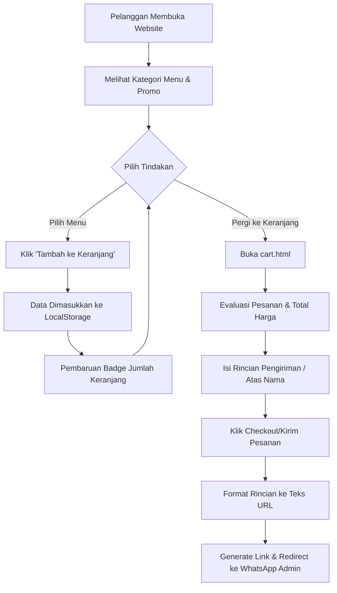

# Lesehan Mey-Mey Website

Website portal pemesanan dan katalog menu untuk UMKM "Lesehan Mey-Mey", sebuah restoran kuliner tradisional Indonesia yang berlokasi di Jogorogo, Ngawi. Website ini dibangun untuk memudahkan pelanggan melihat menu terbaru, promo, dan melakukan pemesanan (checkout) yang terintegrasi secara langsung dengan WhatsApp.

## 🌟 Fitur Utama

- **Katalog Menu Dinamis**: Menampilkan daftar makanan dan minuman dengan kategori (PAHE, Ayam & Bebek, Seafood, Camilan, Minuman) yang difilter secara langsung (Live Tab Filter).
- **Sistem Keranjang Belanja (Cart System)**: Pengguna dapat menambahkan item menu ke keranjang. Data keranjang akan tersimpan secara lokal menggunakan *Local Storage* sehingga tidak hilang jika refresh halaman.
- **Validasi dan Checkout Via WhatsApp**: Memungkinkan pelanggan melakukan peninjauan pesanan di halaman keranjang dan langsung diarahkan ke chat WhatsApp admin warung lengkap dengan rincian pesanan.
- **Desain Modern & Responsif**: Tampilan yang rapi, modern, dengan animasi (*fade in/out*) elegan dan dapat menyesuaikan tampilan layar (*Mobile & Desktop friendly*).
- **SEO Optimized**: Dioptimalkan dengan *meta tag* lengkap dan terstruktur.

## 🛠️ Teknologi yang Digunakan

Website dikembangkan tanpa framework berat, menjadikannya sangat cepat dan ringan (Static web):
- **HTML5** untuk struktur antarmuka.
- **CSS3** (Kustom Vanilla CSS) untuk efek, tata letak, dan animasi halus.
- **JavaScript (Vanilla)** untuk fungsionalitas keranjang, filter menu, animasi on-scroll, dan integrasi WhatsApp.
- **Font Awesome** untuk kustomisasi *icons*.
- **Google Fonts** (Outfit dan Playfair Display) untuk tipografi yang menarik.

## 📁 Struktur Direktori

```text
lesehan_mey_mey/
├── index.html           # Halaman Utama (Beranda, Menu, Lokasi, dll)
├── cart.html            # Halaman Keranjang Belanja & Checkout
├── assets/
│   ├── css/
│   │   ├── style.css             # Styling utama halaman website
│   │   └── inner-animations.css  # Styling khusus untuk efek animasi
│   ├── js/
│   │   ├── script.js             # Logika interaksi UI utama (Navigasi, Filter)
│   │   └── cart.js               # Logika sistem keranjang (Add-to-cart, LocalStorage, WA Checkout)
│   └── images/
│       └── ...                   # Kumpulan foto aset (menu, gambar layout)
└── README.md            # Dokumentasi Proyek
```

## 🔄 Alur Sistem (Workflow)



## 🚀 Cara Menjalankan Project

Karena ini merupakan website statik berbasi client-side, Anda dapat menjalankannya dengan sangat mudah:

### Cara 1: Buka Secara Langsung (Tanpa Server)
1. Buka folder/direktori `lesehan_mey_mey`.
2. Klik ganda (`Double-click`) file `index.html` untuk membukanya di browser bawaan Anda (Chrome/Firefox/Edge).

### Cara 2: Local Server (Sangat Disarankan)
Cara ini disarankan untuk menghindari *CORS issues* dari pembacaan *localStorage* jika browser memiliki pengaturan memblokir penyimpanan akses file lokal (file://).
1. Pastikan Anda memiliki Ekstensi seperti **Live Server** di VSCode / VSCodium, atau menggunakan Node.js.
2. Jika menggunakan Ekstensi *Live Server*, klik kanan di dalam file `index.html` kemudian pilih **"Open with Live Server"**.
3. Jika menggunakan Python (opsional): Buka terminal dalam folder, dan jalankan perintah: `python -m http.server 8000` lalu akses `http://localhost:8000` di peramban Anda.

## 📞 Informasi Kontak
**Lokasi**: Jl. Gonggang-Karangudi, Jogorogo, Kec. Jogorogo, Kab. Ngawi.<br>
**Jam Operasional**: 09.00 - 20.00 WIB

---
*Dibuat untuk memudahkan operasional transaksi kuliner "Lesehan Mey-Mey".*
